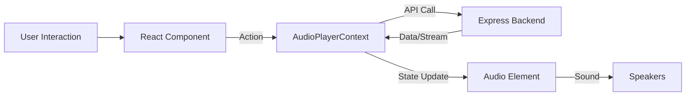

# StreamLite - User Frontend Application 🎨

**StreamLite Frontend** is the immersive, polished interface that connects users to the world of music. Built with **React** and **Vite**, it emphasizes speed, visual fidelity (animations), and a seamless "app-like" playback experience.

> **Status:** 🟢 Active | **Version:** 1.0.0 | **Served on:** `localhost:5173`

---

## 📑 Table of Contents
1.  [Application Architecture](#-application-architecture)
2.  [Component Breakdown](#-component-breakdown)
3.  [State Management (The Core)](#-state-management-the-core)
4.  [Tech Stack & Dependencies](#-tech-stack--dependencies)
5.  [Folder Structure](#-folder-structure)
6.  [Installation & Dev Workflow](#-installation--dev-workflow)

---

## 🏗 Application Architecture

The frontend is a **Single Page Application (SPA)**. It loads once and effectively handles all navigation client-side, ensuring music never stops playing when you switch pages.

### Data Flow Diagram



---

## 🧩 Component Breakdown

### 1. The Global Players
These components live outside the `<Routes>` and persist throughout the session.
*   **`AudioPlayer.jsx`**: The fixed bottom bar. It attaches to the `AudioPlayerContext` to visualize time, volume, and track info. It manages the HTML5 `<audio>` tag refs.
*   **`Navbar.jsx`**: Responsive top navigation. Adapts to scroll state (transparent -> glassmorphism).

### 2. The Context Layer
*   **`AudioPlayerContext.jsx`**: The "Brain" of the app.
    *   **Functions:** `playTrack(track)`, `pause()`, `next()`, `prev()`.
    *   **Logic:** Handles the "Resolution Bridge"—if a track is from Spotify, it asks the backend to resolve it before setting the audio source.
*   **`AuthContext.jsx`**: Manages the JWT token in `localStorage` and provides `user` object to the app.

### 3. Page Views
*   **`landingPage.jsx`**: A visual masterpiece using HTML5 Canvas for particle animations. Purely presentation.
*   **`userMusicDashboard.jsx`**: The main hub. Displays "Trending", "New Releases" (via Spotify API), and "Local Hits".
*   **`UserSearch.jsx`**: A real-time search interface with debounced inputs to prevent API flooding.

---

## ⚡ State Management (The Core)

We use React's **Context API** to avoid prop-drilling.

### The Playback Cycle

1.  **User Clicks Play** on a `TrackCard`.
2.  `playTrack(track)` function in Context is triggered.
3.  **Source Check:**
    *   If `track.source === 'local'`, set `audio.src = track.audio_url`.
    *   If `track.source === 'spotify'`, call `await fetch('/api/resolve')`.
        *   Backend returns a temporary Audius Stream URL.
        *   Context sets `audio.src = returned_url`.
4.  **State Update:** `isPlaying` becomes `true`, `currentTrack` is updated.
5.  **UI Reaction:** Use `useEffect` in `AudioPlayer.jsx` to detect `currentTrack` change and auto-play.

---

## 💻 Tech Stack & Dependencies

| Tool | Purpose |
| :--- | :--- |
| **Vite** | Build tool. Replaces Webpack. Starts server in milliseconds. |
| **React 18** | UI Library. Uses Hooks (`useState`, `useEffect`) extensively. |
| **Tailwind CSS v3** | Styling. No CSS files (except entry). Utility-first classes. |
| **React Router v6** | Client-side routing. Enables SPA behavior. |
| **Lucide React** | Feather-light SVG icons (Play, Pause, Home buttons). |
| **React Toastify** | Feedback popups (errors, success messages). |

---

## 📂 Folder Structure

The project follows a "Feature-First" organization within standard type directories.

```text
src/
├── components/          # Dumb/UI Components
│   ├── AudioPlayer.jsx
│   ├── TrackCard.jsx    # Pure display component
│   └── ...
├── context/             # App Business Logic
│   ├── AudioPlayerContext.jsx
│   └── AuthContext.jsx
├── pages/               # Route Views
│   ├── user/            # Authenticated Views
│   │   ├── userMusicDashboard.jsx
│   │   └── ...
│   └── admin/           # (Legacy/Removed - see separate Admin App)
├── assets/              # Images, Fonts
└── App.jsx              # Route Tree Definitions
```

---

## 🛠 Installation & Dev Workflow

### Prerequisite
Ensure the **Backend** is running on `:3000`.

### Steps
1.  **Install:** `npm install`
2.  **Dev Server:** `npm run dev`
    *   Starts at `http://localhost:5173`.
3.  **Build for Production:** `npm run build`
    *   Generates optimized static files in `/dist`.

### Common Issues
*   **"Audio Source Error"**: Usually means the Backend Resolver failed or the Audius API is unreachable.
*   **"403 Forbidden"**: Your Token expired. Log out and Log back in.
